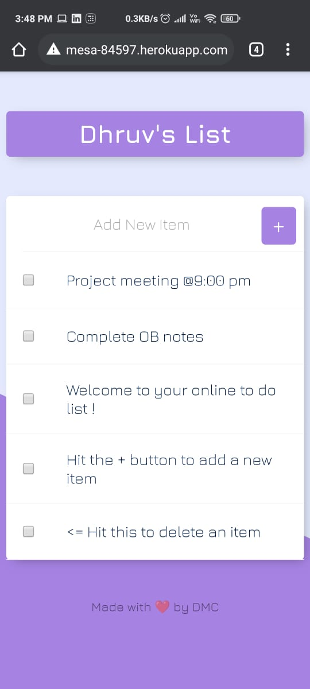
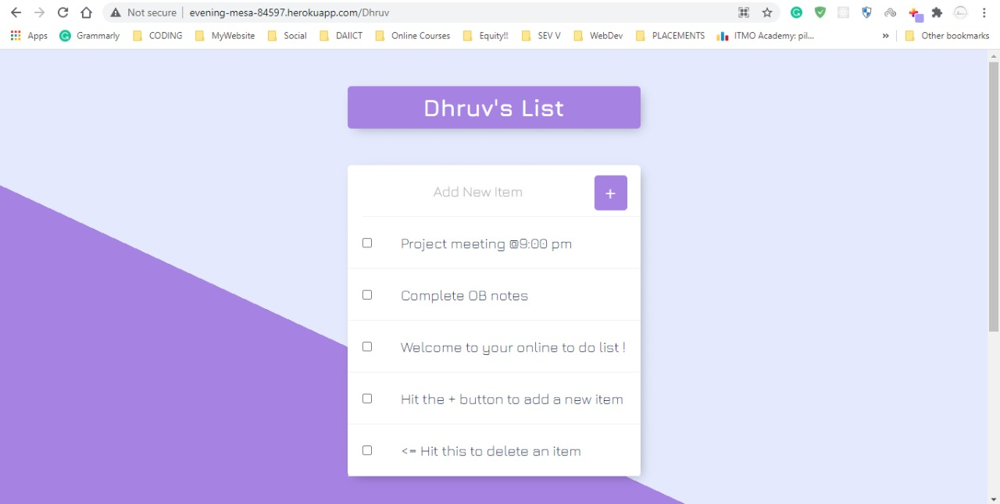

# Your Personal To-Do-List

[LINK: To-Do-List](https://evening-mesa-84597.herokuapp.com/)  
*(Add your name at the end to get your Own to-do-list)*

This is a simple To-Do-List which is created using EJS and Node.js.  
It is Backed by MongoDB Atlas so your list is Stored safely in the cloud and you can easily access it from **Anywhere, Anytime**

## How to Use it

Just add your name behind the link and It'll generate a brand new list for you.

*   **Mobile View**

    

*   **Desktop View**

    

## How to Contribute

Clone this repo to your System
```bash
git clone https://github.com/DhruvChavda/To-Do-List.git
cd To-Do-List
```

Install required modules and start the app
```node
npm install
node app.js
```
use `nodemon app.js` if **nodemon** is installed.

Add your environment variables as per the dummy env file given.

ENJOYY!!
